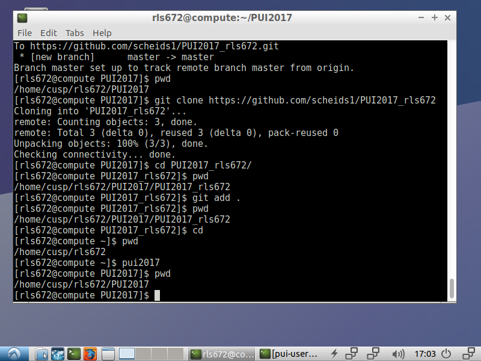

Assignment 1: Finish Lab 

Purpose/Learning Goals: To learn how to create and manage a git repo with Github. 

Process: I followed instructions laid out in Prof. Bianco's github (Lab1_fb55). jss895 forked my repo (rls672) and I forked his (gittest_jss895). 

Assignment 2: Set Up Environment 

Purpose/Learning Goals: To correctly and efficiently set up environment using an environmental variable and an alias. 

Process: 
1) I created a directory called PUI2017 using mkdir 
2) I created an environmental variable using 'export'. This tells the machine that PUI2017 means the given file path.
3) I created an alias using 'alias'.  This tells the machine when I type 'pui2017' to change directory to the path specified in the environmental variable.

Assignment 3: Reproducible Research (Extra Credit) 

Purpose/Learning Goals: To think about reproducibility, introduce concept of 'pseudo-random', and to create code that allows for reproducible research. 

Process: 
For this assignment, I initially struggled to understand what was being asked. Classmates helped to explain the question. 

I was able to do the first half of the question independently (creating array, checking shape, using numpy seed, etc).

I worked with Dana, Emily P., and Ruben on the coding of the for loops for plotting (the final chunk of code). 
 